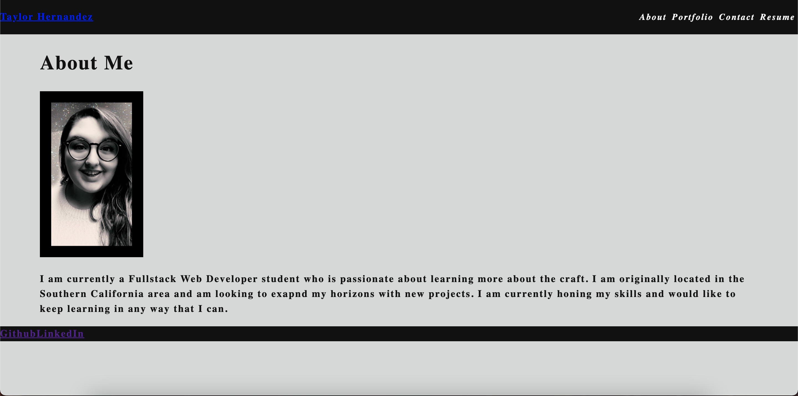

<h1 align="center"> React Portfolio </h1>

 
## Description
This my current portfolio

## Table of Contents
- [Description](#description)
- [Installation](#installation)
- [License](#license)
- [Contributing](#contributing)
- [Tests](#tests)
- [Questions](#questions)
## Installation
Just run the application by going to https://tayhern.github.io/Portfolio-R/
or if you have problems running the link, download the source code and in the terminal, cd into portfolio-app.  Then run npm start to open the portfolio in localhost.

## License

 
This application is covered by the MIT license. 
## Contributing
Taylor Hernandez
## Tests
Not right now.
## Questions
Just email hernandeztaylor1@gmail.com 
 
:octocat: Find me on GitHub: [TayHern](https://github.com/TayHern) 
 
Email me with any questions: hernandeztaylor1@gmail.com  
  
